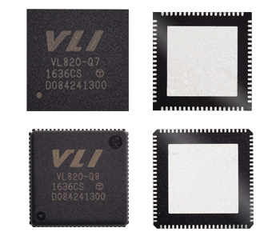
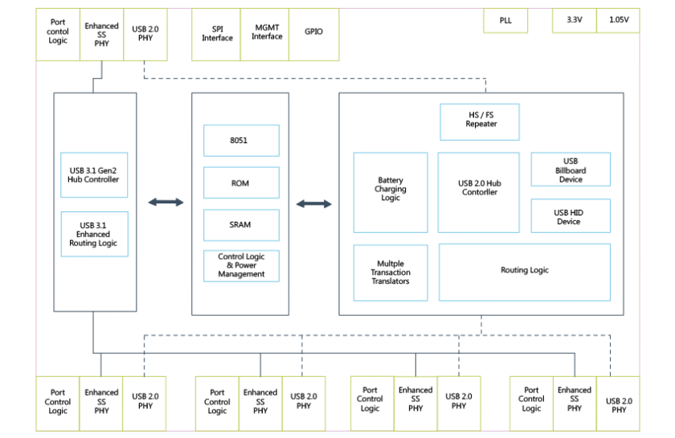

## [VL820](https://github.com/qful/keyboard) 

 

#### Description

VL820 features 1x upstream port and 4x downstream ports, all of which support 10Gbps USB 3.1 Gen 2 operation. 

The downstream ports can support any combination of SuperSpeed Plus (10Gbps), SuperSpeed (5Gbps), High Speed (480Mbps), Full Speed (12Mbps), and Low Speed (1.5Mbps) devices. 

VL820’s integrated USB 2.0 hub features Multiple Transaction Translators, providing increased bandwidth and performance when multiple Full Speed devices are simultaneously used.

#### Power and Package

- 25MHz Xtal
- Requires 3.3V and 1.05V Inputs
- VL820-Q8: QFN 88L green package (10x10x0.85 mm)，Integrated 10Gbps Mux for UFP and 2x DFP
- VL820-Q7: QFN 76L green package (9x9x0.85 mm)

#### Key Features

* USB Type-C 1.0 Rev 1.2 Compliant，Compliant to USB Type-C Specification Rev 1.2
* Additional USB-C DFP support requires separate CC Logic and Mux (Such as VL160) Integrated USB Devices

 